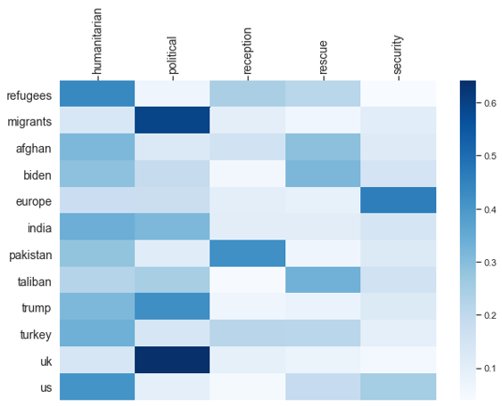

# refugee_project
This repository is used to manage data and code for our master thesis project

# Abstract
In a changing media environment that is now largely considered to be hybrid, social media is becoming an increasingly important tool for the creation and dissemination of news stories. This creates a new form of framing ­ called networked framing ­ where users can partake in the creation of narratives regarding different subjects. 
The specific subject on which this study is focused are refugees who, being a specifically vulnerable group, are particularly susceptible to how they are framed as it affects the manner in which they are treated in the receiving country. 
Taking an interpretivist perspective, this study analysis the central refugee­related events extracted from a sample of 12,758,376 tweets fetched in the time period between January 2020 and April 2021.
By analysing the tweets’ hashtags and text using network analysis and computational frame analysis, this study seeks to answer (I) which frames are most prevalent for each event, (II) which entities are considered to be central actors, and (III) how each entity is framed. 
The study finds differences in the framing of refugees and migrants, where the first is perceived through a humanitarian and settlement frame whereas the latter is comparatively more often associated with economic themes. 
Beyond that, differences between cause­related and consequence­related events are observed. 
As the refugees get closer to receiving countries, frames increasingly revolve around consequences whereas at the sources of the refugee’s plight humanitarian and cause­related frames, such as violence, prevail.

**Keywords: Networked Framing, Network Analysis, Natural Language Processing, Refugee Crisis, Social Data Science**

**Process:**
In the **Code** folder, jupyter notebooks describe the project from the data extraction until the results.
The notebooks are organized based on 6 project phases:
 1. Twitter Data Fetch
 2. File Consolidation
 3. Event Selection
 4. Tweets Preprocessing
 5. a. Entity Identification
 	b. Frame Identification
 	c. Networks (our benchmark)
 6. Frame attribution

The result:
*Example of Taliban takeover of Kabul*

**Findings:**
 - Strong humanitarian and political frames
 - Refugees in humanitarian vs. Migrants in political
 - Different roles of countries – EU security, UK political, US humanitarian

